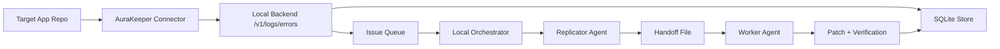

# Local CLI `onboard` Design

## Status

Draft

## Summary

Add a locally running AuraKeeper CLI with an `onboard` command that wires a
target repository into a complete local repair loop:

1. detect the repository runtime and package manager
2. select the most relevant AuraKeeper collector for that repository through a
   backend-brokered local Codex call
3. provision a local AuraKeeper project and token
4. write local configuration that points the connector at a local backend
5. start or configure a local backend that receives events
6. start a local orchestrator that turns accepted events into repair attempts
7. run focused Replicator and Worker agents against the same repository

The first implementation should optimize for Node.js repositories and the
existing JavaScript connector in [`connectors/javascript`](../connectors/javascript).
The CLI should be safe by default, explicit about what it edits, and never
silently mutate unrelated repository files.

## Problem

The current repository has three separate pieces:

- an ingestion API contract in [`openapi.yaml`](../openapi.yaml)
- a small local backend in [`backend`](../backend)
- agent role definitions in [`agents`](../agents)

What is missing is the developer entry point that makes AuraKeeper usable in a
real local repository. A developer should be able to run one command inside
their app repository and get:

- the right collector installed
- local environment variables and config written
- a running local ingestion endpoint
- a durable local issue/attempt store
- an agent-driven repair loop that can inspect, reproduce, patch, and verify

Without that CLI, the system is a collection of parts rather than a product.

## Goals

- Provide a single local onboarding command: `aurakeeper onboard`.
- Support first-class onboarding for Node.js repositories.
- Install only the collector and dependencies relevant to the detected runtime.
- Keep the backend local by default.
- Start a local repair loop that can invoke the Replicator and Worker agents.
- Persist enough local configuration to resume work without re-onboarding.
- Keep the OpenAPI ingestion path as the canonical event contract.
- Make all filesystem edits previewable and idempotent.

## Non-Goals

- Full multi-language onboarding in the first version.
- Hosted SaaS provisioning.
- Production deployment automation.
- Automatic background daemon installation at OS boot.
- Direct automatic merge or deploy after a patch is generated.
- Broad framework-specific code transformations beyond a narrow Node.js path.

## Primary User Story

Inside a local application repository, a developer runs:

```bash
aurakeeper onboard
```

AuraKeeper then:

1. gathers repository signals and asks the local backend to run a
   local Codex-backed selector that chooses the best collector strategy
2. installs the selected collector package or local collector files
3. inserts a minimal bootstrap snippet into the application entry point or adds
   a generated wrapper file the user can import
4. creates a local AuraKeeper project in the local backend
5. stores the project token and local endpoint in repo config
6. records repo-specific repair settings such as install/test commands and
   allowed repair paths
7. starts the local backend and local orchestrator
8. prints the next command to run and where logs/config live

When the target application emits an error event, the local backend accepts it
through `POST /v1/logs/errors`, persists it, groups it, and enqueues a local
repair attempt. The orchestrator then runs the Replicator Agent followed by the
Worker Agent against the onboarded repository and stores the results locally.

## CLI Surface

## Commands

```text
aurakeeper onboard
aurakeeper start
aurakeeper status
aurakeeper logs
aurakeeper stop
aurakeeper doctor
```

Only `onboard` is in scope for the first milestone. The other commands are
included because `onboard` has to write config that those commands can consume.

## `aurakeeper onboard`

Proposed flags:

```text
aurakeeper onboard [--repo <path>] [--service <name>] [--framework <name>]
                   [--runtime <node>] [--package-manager <npm|pnpm|yarn|bun>]
                   [--entrypoint <path>] [--test-command <cmd>]
                   [--install-command <cmd>] [--allowed-path <path>...]
                   [--port <number>] [--backend-dir <path>]
                   [--dry-run] [--json]
```

Behavior:

- defaults `--repo` to the current working directory
- detects settings automatically when flags are omitted
- shows the planned edits before writing unless `--json` is used
- writes only the minimal repo changes needed to send events locally
- provisions AuraKeeper local config in both the target repo and AuraKeeper's
  own state directory
- is safe to rerun and should converge rather than duplicate setup

## High-Level Architecture

`onboard` sets up three cooperating local components:

1. Connector layer inside the target repository
2. Local backend that owns ingestion, grouping, persistence, and queueing
3. Local orchestrator that consumes queued issues and runs agents



## Repository Detection

The first version should support one opinionated path well: Node.js repos.
Detection should still happen locally, but local heuristics are only used to
assemble repo evidence and as a fallback when the model selector is unavailable.

Repo evidence collection:

- `package.json` present -> Node.js candidate
- lockfile presence selects package manager:
  - `pnpm-lock.yaml` -> `pnpm`
  - `yarn.lock` -> `yarn`
  - `bun.lock` or `bun.lockb` -> `bun`
  - otherwise `npm`
- framework heuristics from `package.json` dependencies:
  - `next` -> Next.js
  - `express` -> Express
  - `fastify` -> Fastify
  - no strong signal -> generic Node.js

Additional evidence to collect for the selector:

- repository root name
- `package.json` scripts
- TypeScript presence
- likely entry points
- monorepo indicators such as `turbo.json`, `nx.json`, or workspace fields
- existing error tooling such as Sentry or Rollbar SDKs
- server-only, browser-only, or hybrid runtime hints

## Agentic Collector Selection

Collector selection should be an explicit model step, not a hardcoded `if/else`
branch in the CLI.

### Why

Collector choice is not just runtime detection. It needs to answer:

- which collector family fits the repo best
- whether the repo needs browser, server, or both collectors
- which entry point is safest to patch
- whether confidence is high enough for auto-patching
- what fallback strategy to use when patching is unsafe

Those decisions are contextual and will become harder as more collectors are
added. An agentic selection step keeps the CLI extensible without encoding a
large matrix of framework-specific rules directly into code.

### Selector inputs

The CLI should gather a compact structured snapshot and send it to the local
backend. The backend then calls the local Codex CLI:

- repository path
- top-level files
- package manager
- runtime candidates
- framework candidates
- package manifest summary
- lockfile summary
- likely entry points
- candidate collector inventory known to AuraKeeper
- whether auto-patching is allowed

### Selector output

The model must return strict JSON with:

- `collector_id`
- `runtime`
- `framework`
- `strategy`
  - `dependency`
  - `vendor`
  - `manual_only`
- `bootstrap_file`
- `entrypoint_path`
- `patch_mode`
  - `auto_patch`
  - `generate_import_only`
- `confidence`
- `reason`
- `edits`
- `warnings`

Example:

```json
{
  "collector_id": "javascript-node-nextjs",
  "runtime": "node",
  "framework": "next",
  "strategy": "dependency",
  "bootstrap_file": ".aurakeeper/collector.ts",
  "entrypoint_path": "app/layout.tsx",
  "patch_mode": "generate_import_only",
  "confidence": 0.88,
  "reason": "Next.js app router detected with browser and server code paths; use the JavaScript collector and avoid direct layout mutation unless the import location is clear.",
  "edits": [
    ".aurakeeper/config.json",
    ".aurakeeper/collector.ts",
    ".env.local"
  ],
  "warnings": [
    "Monorepo workspace detected; service root was inferred from apps/web."
  ]
}
```

### Brokering model

The CLI should not talk to Codex directly for collector selection. The local
backend should broker the model call.

Why this is the preferred design:

- credentials stay centralized in the backend
- model usage can be audited in one place
- prompts and response validation stay versioned server-side
- the CLI remains thinner and easier to port
- fallback behavior can be standardized across clients

Proposed flow:

1. CLI gathers repo evidence.
2. CLI sends that evidence to a local backend endpoint.
3. Backend builds the selector prompt and collector inventory payload.
4. Backend calls local Codex in non-interactive mode.
5. Backend validates the JSON response against a strict schema.
6. Backend returns the normalized selection result to the CLI.

### Selector instructions

The selector prompt should be narrow and operational. It should tell the model:

- choose only from the collector inventory provided
- prefer the smallest safe integration
- do not invent unsupported collectors
- avoid auto-patching when confidence is low
- prefer `generate_import_only` over risky edits
- return valid JSON only
- explain uncertainty in `warnings`

### Fallback behavior

If the Codex call fails, times out, or returns invalid JSON:

1. fall back to deterministic local heuristics
2. choose the generic Node.js JavaScript collector
3. disable auto-patching unless confidence is high from local heuristics
4. record that fallback mode was used

This keeps `onboard` usable offline or during provider failures.

## Collector Installation Strategy

The repository already contains a JavaScript collector implementation. The CLI
should not require users to copy files manually.

### Preferred first implementation

Create a distributable CLI package plus a distributable JavaScript collector
package. During onboarding:

1. run the model selector and choose the collector
2. add the selected collector dependency to the target repo
3. generate a small bootstrap file in the target repo, for example
   `.aurakeeper/collector.{js,ts}`
4. patch one application entry point to import that bootstrap file only if the
   selector returns `patch_mode=auto_patch`

This is better than inlining large snippets because:

- reruns remain predictable
- upgrades are easier
- the injected change is small
- repo-specific logic stays in generated config, not handwritten edits

### Fallback path

If dependency installation is disabled or impossible, `onboard` can vendor a
copy of the collector under `.aurakeeper/vendor/javascript/`. This should be a
fallback only because it complicates upgrades.

## Target Repo Changes

`onboard` should restrict its edits to a small set of explicit files:

- `.aurakeeper/config.json`
- `.aurakeeper/collector.js` or `.aurakeeper/collector.ts`
- `.env.local` or `.env`
- one detected application entry point, if the user approves or if a generated
  wrapper import strategy is clearly defined
- `package.json` only when adding dependencies or scripts

Generated repo config example:

```json
{
  "projectId": "proj_local_123",
  "serviceName": "my-app",
  "runtime": "node",
  "framework": "next",
  "packageManager": "pnpm",
  "endpoint": "http://127.0.0.1:4311/v1/logs/errors",
  "statusEndpoint": "http://127.0.0.1:4311",
  "tokenEnvVar": "AURAKEEPER_API_TOKEN",
  "defaultEnvironment": "development",
  "installCommand": "pnpm install",
  "testCommand": "pnpm test",
  "allowedRepairPaths": [
    "src",
    "app",
    "pages"
  ]
}
```

Environment additions:

```dotenv
AURAKEEPER_API_TOKEN=ak_local_xxx
AURAKEEPER_ENDPOINT=http://127.0.0.1:4311/v1/logs/errors
```

## Local AuraKeeper State

AuraKeeper itself needs local state outside the target repo as well. Proposed
layout:

```text
~/.aurakeeper/
  state/
    projects.json
    processes.json
  runs/
    <project-id>/
      replicator/
      worker/
  logs/
    backend.log
    orchestrator.log
```

This state should track:

- onboarded repos
- project IDs and tokens
- process metadata for local backend/orchestrator
- repair run artifacts

## Backend Changes Required

The current backend supports project creation and error ingestion only. The
local CLI flow requires the backend to become the durable control plane for
local runs.

### Required backend additions

1. Persist project repair configuration.
2. Add `error_groups`.
3. Add `repair_attempts`.
4. Add a local queue or pending-job table.
5. Add read APIs for local status and results.
6. Add local-only endpoints used by the CLI for orchestration.
7. Broker collector-selection model calls for the CLI.

### Proposed new tables

- `project_configs`
  - `project_id`
  - `repo_path`
  - `runtime`
  - `framework`
  - `package_manager`
  - `install_command`
  - `test_command`
  - `allowed_repair_paths`
  - `entrypoint_path`
  - `created_at`
  - `updated_at`
- `error_groups`
  - `id`
  - `project_id`
  - `fingerprint`
  - `status`
  - `first_seen_at`
  - `last_seen_at`
  - `event_count`
  - `representative_log_id`
- `repair_attempts`
  - `id`
  - `project_id`
  - `error_group_id`
  - `status`
  - `replicator_handoff_path`
  - `patch_summary`
  - `verification_command`
  - `verification_exit_code`
  - `confidence`
  - `created_at`
  - `updated_at`
- `repair_jobs`
  - `id`
  - `project_id`
  - `error_group_id`
  - `status`
  - `attempts`
  - `available_at`
  - `locked_at`
  - `worker_id`

### Proposed local-only API additions

- `POST /v1/local/projects/onboard`
- `POST /v1/local/collector-selection`
- `PUT /v1/local/projects/:projectId/config`
- `GET /v1/local/projects/:projectId/status`
- `GET /v1/local/error-groups`
- `GET /v1/local/repair-attempts`
- `POST /v1/local/repair-jobs/:jobId/claim`
- `POST /v1/local/repair-jobs/:jobId/complete`

These endpoints should be reflected in `openapi.yaml` if adopted. The repo
instructions explicitly say that the OpenAPI file is the ground truth and must
remain in sync.

## Event Flow After Onboarding

1. Target app throws or captures an error.
2. Installed connector normalizes the payload and sends it to the local
   backend.
3. Backend authenticates the project token and stores the raw event.
4. Backend computes a deterministic fingerprint and upserts an `error_group`.
5. Backend enqueues a repair job when the group is new or crosses a threshold.
6. Local orchestrator claims the job.
7. Orchestrator runs the Replicator Agent with the representative event, repo
   path, and project config.
8. Orchestrator stores the handoff artifact.
9. Orchestrator runs the Worker Agent with the handoff and verification command.
10. Orchestrator stores the patch/result and updates attempt status.

## Local Orchestrator

The local orchestrator is a separate long-running process from the HTTP backend.
This keeps ingestion fast and avoids blocking request handling on agent work.

Responsibilities:

- poll or subscribe for pending `repair_jobs`
- materialize a per-attempt working directory
- pass strict instructions and allowed paths to agents
- capture stdout, stderr, exit codes, and artifact paths
- update attempt/job state in the backend store
- enforce concurrency limits

### Working directory model

First version:

- operate directly against the onboarded repository
- require explicit allowed repair paths
- write artifacts under `~/.aurakeeper/runs/<project-id>/<attempt-id>/`

Later version:

- use per-attempt git worktrees or sandbox checkouts

The later version is safer, but it should not block the first local loop if the
CLI makes the write scope explicit.

## Agent Invocation Contract

The CLI design should not hardcode model logic into the connector or backend.
Instead, the orchestrator should assemble structured inputs for the existing
Replicator and Worker roles.

### Replicator input

- project config
- representative event payload
- grouped issue summary
- repo path
- relevant source file hints
- install/test/repro commands
- allowed command set

### Worker input

- replicator handoff file
- representative event payload
- repo path
- allowed repair paths
- verification command
- project instructions

### Local safety rules

- no destructive git commands
- no writes outside the target repo and AuraKeeper state dir
- no edits outside allowed repair paths
- no dependency upgrades unless the task explicitly permits them
- no PR creation in the initial local mode

## Process Model

`aurakeeper onboard` should offer two operating modes.

### Mode A: foreground dev mode

Best for first release.

- `onboard` writes config and then offers `aurakeeper start`
- `start` runs backend and orchestrator in the current terminal
- simplest logs and least OS-specific behavior

### Mode B: managed background mode

Later improvement.

- `onboard` starts detached processes
- `status`, `logs`, and `stop` inspect/manage them
- requires stronger PID, lock, and log rotation handling

The first milestone should implement Mode A well and optionally provide a
best-effort detached mode on platforms where it is straightforward.

## Onboarding Algorithm

1. Resolve target repo path.
2. Verify the path is a git repo or at least a plausible application repo.
3. Detect runtime, framework, package manager, and likely entry point.
4. Gather repo evidence and available collector inventory.
5. Send repo evidence to the local backend for collector selection.
6. Infer service name from repo folder name unless explicitly provided.
7. Infer install/test commands from package manager and `package.json`.
8. Show planned file edits and commands.
9. Create or reuse a local AuraKeeper project and token.
10. Write AuraKeeper repo config.
11. Add environment variables for endpoint and token.
12. Install the selected collector dependency or vendor fallback.
13. Generate bootstrap file.
14. Patch the entry point or emit a minimal required import step based on the
    selector output.
15. Persist project repair config in the local backend.
16. Print next steps, process commands, and edited file list.

## Failure Modes

The CLI should make partial setup explicit and resumable.

Examples:

- dependency install failed
- entry point detection failed
- selector call failed
- backend selector endpoint unavailable
- repo is unsupported
- backend port is already in use
- backend project provisioning succeeded but repo patching failed

Required behavior:

- write a machine-readable onboarding result file
- distinguish `completed`, `partial`, and `failed`
- list exact next actions to recover
- never leave duplicate environment or import lines on rerun

## Idempotency

`onboard` will be rerun frequently. It should:

- reuse the same project token unless the user forces regeneration
- avoid adding duplicate dependencies
- avoid adding duplicate bootstrap imports
- update generated files in place
- preserve manually edited files where possible
- annotate generated sections clearly when patching existing files
- cache the last successful collector selection result for reruns

## Security and Privacy

Even in local mode, the CLI handles sensitive app context.

Requirements:

- connector should support redaction hooks before send
- local backend should store raw payloads intentionally, with a clear retention
  story later
- backend should bind to loopback by default
- local tokens are repo-scoped, not global admin tokens
- backend-owned Codex invocation details should never be written into target repos
- logs should avoid dumping full secrets when requests fail

## OpenAPI Impact

The existing ingestion contract remains valid and should stay the transport
between connectors and the local backend.

If local onboarding and orchestration endpoints are added, `openapi.yaml` must
be updated in the same change. The spec should remain the source of truth for:

- project creation/provisioning
- collector-selection request and response schemas if exposed over HTTP
- local project config upserts if exposed over HTTP
- local status/read endpoints needed by the CLI

## Proposed Package Layout

```text
cli/
  package.json
  src/
    index.ts
    commands/
      onboard.ts
      start.ts
      status.ts
    detect/
      node.ts
    select/
      collector.ts
      fallback.ts
    install/
      javascript.ts
    patch/
      env.ts
      imports.ts
    state/
      local-state.ts
    backend/
      client.ts
      collector-selection.ts
    orchestrator/
      supervisor.ts
```

This keeps the CLI logic separate from `backend/` while allowing shared helper
modules later if needed.

## Milestones

### Milestone 1: usable Node.js local onboarding

- add `cli/` package
- implement `aurakeeper onboard`
- support Node.js repo detection
- add model-backed collector selection
- write `.aurakeeper/config.json`
- write token and endpoint env vars
- install selected collector
- generate bootstrap file
- persist local project config
- manual `aurakeeper start` runs backend and orchestrator in foreground

### Milestone 2: local issue and repair loop

- add `error_groups`, `repair_jobs`, `repair_attempts`
- add deterministic fingerprinting
- enqueue repair jobs from ingestion
- orchestrator claims jobs and runs Replicator then Worker
- store handoff and verification artifacts

### Milestone 3: stronger repo patching and UX

- smarter entry point detection
- dry-run and JSON machine output
- `status`, `logs`, `doctor`, `stop`
- better partial-recovery flows

### Milestone 4: safer execution

- per-attempt worktree or sandbox checkout
- concurrency control
- redaction and retention controls
- support additional connectors and languages

## Open Questions

- Should local project provisioning happen through HTTP to the backend, or
  should the CLI write directly to the same SQLite store for pure local mode?
  HTTP is cleaner and keeps one control plane.
- Should `onboard` auto-patch an entry point, or should the first version only
  generate a bootstrap file and print the import the user must add?
  Auto-patching is smoother, but only when detection confidence is high.
- Should collector selection call OpenAI directly from the CLI, or should the
- Should the orchestrator operate directly in the working tree for Milestone 1,
  or should worktree isolation be mandatory from day one?
  Mandatory isolation is safer, but it will slow the first usable loop.
- Should the CLI own process supervision, or should it initially rely on one
  foreground command per session?
  Foreground is much simpler and is the right first cut.

## Recommendation

Implement the first version as:

- a new `cli/` package
- Node.js-only onboarding
- model-backed collector selection with deterministic fallback
- local HTTP provisioning against the existing backend
- foreground `start` process model
- generated `.aurakeeper/collector.js` bootstrap file
- minimal, confidence-based entry-point patching
- backend-backed `project_configs`, `error_groups`, `repair_jobs`, and
  `repair_attempts`

That path yields a complete local story without pretending to solve every
runtime or process-management edge case up front.
